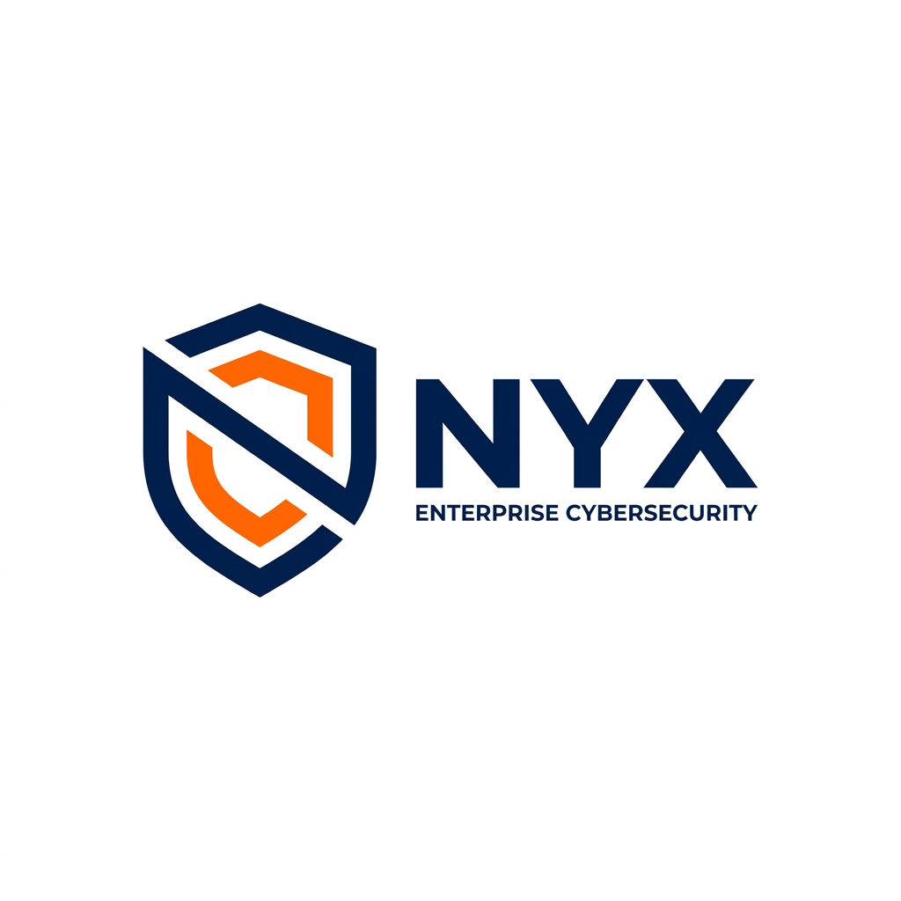

<p align="center">
  
</p>

<h1 align="center">Nyx</h1>
<p align="center">
  <strong>Next-Generation Web Security Testing Suite</strong>
</p>

<p align="center">
  <a href="#features">Features</a> •
  <a href="#quick-start">Quick Start</a> •
  <a href="#architecture">Architecture</a> •
  <a href="#desktop-app">Desktop App</a> •
  <a href="#building-from-source">Building</a> •
  <a href="#documentation">Documentation</a> •
  <a href="#license">License</a>
</p>

<p align="center">
  
  
  
  
  
  
  
</p>

---

## Overview

**Nyx** is an open-source, modular web security testing platform built for penetration testers and security researchers. It combines traffic interception, automated vulnerability scanning, intelligent fuzzing, auto-exploit generation with interactive PoCs, and professional report generation into a single, cohesive suite — available as a **desktop app** (no Docker or Python required), a **Docker deployment**, or a **source-based development setup**.

### Feature Overview

| Area | Capabilities |
|------|-------------|
| **Traffic interception** | ARP spoofing (zero-config LAN MITM), transparent proxy, regular forward proxy, WebSocket capture |
| **Vulnerability scanning** | 210+ passive checks, 110+ active probes, custom regex checks, content discovery, JS-aware crawler |
| **Automation** | Scheduled scans, webhooks, auto-reports, auto-exploit PoC generator (21+ CWE types) |
| **Testing tools** | Repeater, Fuzzer (multi-mode), Sequencer, Comparer, Decoder, Session Handling |
| **OAST** | Self-hosted Collaborator server (Go) for blind XXE/SSRF/DNS exfiltration detection |
| **Advanced MITM** | ARP scan + multi-target selection + DNS spoofing + captive portal + gRPC parsing (native C++ module) |
| **Smart Triage** | Severity-based finding grouping, retest, CVE-style workflow with filtering |
| **Recommendation Engine** | Auto-suggests next actions (fuzz, exploit, scan) when findings are created |
| **Auto Exploit** | URL structure analysis + DB findings lookup → smart CWE suggestions with ranking |

Nyx is an open-source web security testing platform. It provides traffic interception, automated scanning, fuzzing, and reporting — with a focus on LAN-based zero-config MITM interception and self-hosted OAST.

---

## Features

### 🔀 Traffic Analysis
| Module | Description |
|--------|-------------|
| **Proxy** | HTTP/HTTPS intercepting proxy with live WebSocket streaming |
| **Interceptor** | Pause, inspect, and modify requests/responses in real time |
| **Repeater** | Manually craft and replay HTTP requests with full header control |
| **Match & Replace** | Automated request/response rewriting rules (regex supported) |
| **WebSocket Viewer** | Inspect and replay WebSocket frames |

### 🔍 Scanning & Discovery
| Module | Description |
|--------|-------------|
| **Passive Scanner** | 210+ checks analyzing traffic in real time for vulnerabilities |
| **Active Scanner** | 110+ active probes: SQLi, XSS, SSRF, SSTI, XXE, IDOR, and more |
| **Smart IDOR Check** | JSON-aware IDOR detection that compares schema vs values (cross-account data access) to eliminate false positives |
| **Custom Checks** | User-defined regex/string checks with severity, run against captured requests |
| **Content Discovery** | Directory/file brute-forcing with wildcard/catch-all baseline filtering & auto-finding for sensitive files (`.env`, `.bak`) |
| **Crawler** | JS-aware autonomous spidering via Playwright (headless Chromium) |
| **Collaborator (OAST)** | Self-hosted out-of-band server (Go) — detects blind XXE, blind SSRF, DNS exfiltration via DNS/HTTP interactions with webhook forwarding |
| **Live Audit** | Continuous passive analysis of all proxied traffic |

### ⚡ Automation & Workflows
| Module | Description |
|--------|-------------|
| **Auto-Auth Keeper** | Zero-config session recovery. Silently learns your login POSTs and auto-refreshes tokens/cookies if a scan hits a 401/403. |
| **Scheduled Scans** | Cron-based scan scheduling (e.g. nightly full scans) |
| **Webhooks** | Instant Slack/Discord alerts on new findings |
| **Auto-Reports** | Automated JSON/HTML/Markdown report generation with severity charts |
| **Auto-Exploit** | CWE-to-PoC engine with interactive HTML pages, URL analysis + DB findings lookup → smart CWE ranking, context-aware encoding, data extraction payloads (21+ CWE types) |
| **Recommendation Engine** | Listens to `finding.created` events and auto-generates actionable recommendations — "Fuzz this parameter", "Generate exploit", "Active scan endpoint", "Retest", "Crawl", "Content discovery" |
| **Smart Triage** | Severity-based finding grouping with filtering, retest endpoint, recent findings view |
| **CSRF PoC Generator** | One-click proof-of-concept HTML for CSRF vulnerabilities |
| **Scan Templates** | Save and reuse scan configurations |
| **Param Discovery** | Automated parameter discovery and chaining |

### 🛠 Advanced Tools
| Module | Description |
|--------|-------------|
| **Fuzzer** | Multi-mode parameter fuzzing (Sniper, Battering Ram, Cluster Bomb) with wordlists, extractors, and grep matchers |
| **Sequencer** | Token entropy analysis (chi-squared, compression ratio, Monte Carlo) |
| **Comparer** | Side-by-side request/response diffing |
| **Decoder** | 15 codecs: Base64, JWT, URL, hex, hashes, Gzip, and more |
| **API Inspector** | Automatic REST, GraphQL, and gRPC detection and classification |
| **Inspector** | Deep HTTP request/response analysis |
| **Search** | Full-text search across all captured traffic |
| **Session Handling** | Macro-based session management and cookie jar automation |
| **Backup & Export** | Full DB backup + findings export in JSON/CSV with severity/module/session filters |

### 📊 Management
| Module | Description |
|--------|-------------|
| **Dashboard** | Real-time overview: findings, trends, scan activity, traffic stats, fuzz job counts, active pipelines, recommendations widget |
| **Recommendations** | Dedicated page listing all active recommendations grouped by module, with execute and dismiss actions |
| **Smart Triage** | Severity-grouped findings with filtering, retest, recent view |
| **Plugins** | Plugin registry — list, register, toggle, delete, reload |
| **Settings** | System info viewer, proxy host/port/mode editor |
| **WebSocket Messages** | Captured WebSocket frames viewer with direction labels and payload inspection |
| **Auth Scan** | Create/manage auth profiles (form/cookie/header), run authenticated active scans with auto-exploit generation |
| **Scan Policies** | View/manage scan policy configuration files |
| **Automations** | Webhook CRUD + test, Cron-based schedule CRUD + toggle, Scan templates, CSRF PoC generator |
| **Projects** | Isolated workspaces with import/export |
| **Organizer** | Tag, flag, and annotate requests for workflow management |
| **Scan Jobs** | Monitor and manage running scans |
| **Auth Tester** | Automated authentication bypass and authorization testing |

---

## Module Guide — Complete Reference

### 🔀 Traffic Analysis

#### Proxy (Intercepting Proxy)
The core of Nyx — an HTTP/HTTPS intercepting proxy that captures all traffic in real time.

**How to use:**
1. Ensure Nyx backend is running (desktop app or `uvicorn`)
2. Configure your browser/system proxy to `127.0.0.1:8080`
3. Open the **Proxy** tab in Nyx → you'll see requests streaming in live
4. Use the search bar to filter by URL, method, status, or MIME type
5. Click any request to inspect headers, body, and response details
6. Right-click → _Send to Repeater_, _Send to Fuzzer_, _Send to Scanner_, _Send to Comparer_

**Behind the scenes:** The proxy runs on mitmproxy and streams all traffic via WebSocket to the frontend. Every request/response is stored in the database with full metadata (timing, headers, body, cookies).

**Filters available:** Method, status code range, MIME type, URL search/regex, scope-only.

---

#### Interceptor
Pause, inspect, and modify requests/responses in real time before they reach the server/client.

**How to use:**
1. Go to **Interceptor** tab
2. Click the toggle to enable interception
3. Add rules (optional): match by header, body, URL, or status code
4. When paused: **Forward** (send modified) or **Drop** (discard)
5. Edit headers/body in the JSON editor before forwarding

**Use cases:** Modify auth tokens, inject XSS payloads, bypass client-side validation.

---

#### Repeater
Manually craft and replay HTTP requests with full control. Unlike the Interceptor (which sits in the live traffic path), the **Repeater is a standalone HTTP client** — it sends requests directly to the target via `httpx.AsyncClient` without going through the proxy.

| | Proxy (Interceptor) | Repeater |
|---|---|---|
| **How requests arrive** | Captured live from browser/app | Copied manually from Proxy history |
| **Server perspective** | Sees the **modified** request instead of the original | Every send is a **new independent** connection |
| **Traffic flow** | Request is paused, modified, then **continues** to the server | Each click sends a **new** request to the target |
| **Best for** | Altering a single request on the fly while browsing | Testing 100 variations, comparing responses, working offline |

**How to use:**
1. Go to **Repeater** tab → create a session
2. Enter method, URL, headers, and body
3. Click **Send** → response appears immediately
4. Modify and re-send to test different payloads

**Tip:** Right-click any request in Proxy → _Send to Repeater_ to pre-fill method, URL, headers, and body from captured traffic.

---

#### Match & Replace
Automatically rewrite requests/responses on the fly using regex patterns.

**How to use:**
1. Go to **Match & Replace** tab → **Add Rule**
2. Set **Match** (regex/string) and **Replace** (supports `$1`, `$2`)
3. Choose **Scope:** request headers, request body, response headers, response body
4. Toggle enabled

**Examples:** Swap User-Agent, strip security headers, modify CSP, alter redirects.

---

### 🔍 Scanning & Discovery

#### Passive Scanner
Analyzes all proxied traffic in real time for vulnerabilities — **zero intrusive requests, 210+ checks.**

**Detects:** API keys, tokens, passwords, internal IPs, missing security headers, CORS misconfigs, cookie issues, path traversal, open redirects, exposed `.env`/`.git`, technology fingerprinting, and more.

**How to use:** No setup required — activates automatically when proxy traffic flows. Findings appear in real-time in the **Scanner** → _Passive_ tab with severity, evidence, and remediation advice.

---

#### Active Scanner
Proactively probes targets with 110+ check modules.

**Checks include:** SQLi (all major DBs), XSS (reflected/stored/DOM), SSRF, SSTI (Jinja2/Freemarker/Velocity/etc.), XXE (in-band + OOB), Command Injection, Directory Traversal, IDOR, Open Redirect, Prototype Pollution, LDAP Injection, NoSQL Injection, GraphQL Introspection, WebSocket Hijacking.

**How to use:**
1. **Scanner** → **Active Scan** → configure target
2. Select check modules and speed (Slow/Medium/Fast)
3. Click **Start Scan** → findings appear in real-time

---

#### Content Discovery
Brute-force directories and files on a target using customizable wordlists.

**How to use:**
1. **Content Discovery** → enter target URL
2. Select wordlist, extensions (`.php`, `.bak`, `.json`), methods, throttle
3. Click **Start** → results with status codes and timings

**Built-in wordlists:** Common dirs, files, API endpoints.

---

#### Crawler
JS-aware autonomous spider using Playwright (headless Chromium).

**How to use:**
1. **Crawler** → enter starting URL
2. Configure max pages, same-origin, form fill, auth cookies
3. Click **Start** → discovers pages, forms, JS routes, API calls

---

### ⚡ Automation & Workflows

#### Scheduled Scans
Run scans automatically on a cron schedule.

**How to use:**
1. **Automation** → **Scheduled Scans** → **Add Schedule**
2. Set name, target URL, cron expression, template
3. Enable → runs automatically

**Examples:** `0 2 * * *` (daily 2 AM), `0 */6 * * *` (every 6h), `0 0 * * 0` (weekly).

---

#### Webhooks
Send instant alerts to Slack/Discord/custom HTTP on new findings.

**How to use:**
1. **Automation** → **Webhooks** → **Add Webhook**
2. Set name, type (Slack/Discord/Custom), URL, events
3. Test with _Send Test_ button

---

#### Scan Templates
Save and reuse scan configurations.

**How to use:** Configure a scan → **Save as Template** → reuse later. Pre-built: Quick Scan, Full Audit, API Audit, Auth Bypass.

---

#### Auto-Exploit
Generates interactive PoCs for 21+ CWE types. After finding a vulnerability, creates a ready-to-use HTML page demonstrating the exploit.

**Supported types:** XSS (interactive alert/fetch), SQLi (data extraction table), Path Traversal (file reader), Command Injection (terminal emulator), SSRF (port scanner), CSRF (auto-submitting form), XXE (file reader via OOB), SSTI (RCE), Prototype Pollution, and more.

**How to use:**
1. **Auto-Exploit** → enter vulnerable URL/parameter
2. Select CWE type (or auto-detect)
3. Click **Generate Exploit** → interactive HTML PoC
4. Open in browser to test, export for developers

---

#### CSRF PoC Generator
One-click proof-of-concept HTML for CSRF vulnerabilities.

**How to use:** Right-click request in Proxy/Repeater → _Generate CSRF PoC_ → HTML form that auto-submits.

---

#### Param Discovery
Automatically discover and chain parameters.

**How to use:**
1. **Automation** → **Param Discovery** → enter target URL
2. Tests 25+ common parameter names (id, user, admin, token, debug)
3. Chain results to fuzz sequences of parameters

---

### 🛠️ Advanced Tools

#### Fuzzer
Multi-mode parameter fuzzing (comparable to Burp Intruder).

**Attack types:**
| Type | Description |
|------|-------------|
| **Sniper** | One position at a time |
| **Battering Ram** | Same payload in all positions |
| **Pitchfork** | Parallel payload sets |
| **Cluster Bomb** | Cartesian product of all sets |

**How to use:**
1. **Fuzzer** → select request → mark `§PAYLOAD§` positions
2. Choose attack type, payload sets, processors, extractors, grep matches
3. Set rate limit → **Start** → results stream in real-time

**Processors:** Base64, URL encode, hash, uppercase, lowercase, prefix/suffix.

---

#### Sequencer
Token entropy analysis (session tokens, CSRF tokens, reset tokens).

**Tests:** Chi-Square, compression ratio, Monte Carlo, character frequency, bit distribution.

**How to use:** Collect 100+ samples → **Analyze** → entropy score 0-100 + heatmap + bit distribution.

---

#### Comparer
Side-by-side request/response diffing.

**How to use:** Select two items → choose comparison type (headers/body) → color-coded diff (green=added, red=removed, yellow=modified).

**Use cases:** Compare responses with different auth levels, before/after changes.

---

#### Decoder
15 codecs: Base64, URL, hex, HTML, JWT, Hash (MD5/SHA1/SHA256/SHA512), Gzip, Unicode, Charset detection, Recursive decode, Smart Decode, Hash Identify, Format Convert.

**How to use:** Paste input → select operation → result appears immediately. Chain operations by clicking _Send to_.

---

#### API Inspector
Auto-detect REST, GraphQL, gRPC, and SOAP endpoints from proxied traffic.

**How to use:** Proxy traffic normally → **API Inspector** → endpoints automatically classified with parameter schemas, auth requirements, and rate limiting hints.

---

#### Inspector
Deep analysis of individual requests/responses.

**Features:** Parsed headers with security warnings, formatted body (JSON/XML/HTML), params, cookies with flag analysis, timing breakdown (DNS/connect/TTFB), redirect chain.

---

#### Session Handling
Macro-based session management with cookie jar.

**How to use:**
1. **Session Handling** → create **Session Rule** (URL match + action)
2. Create **Macro:** sequence of requests (login → get token → access)
3. Extract values from responses via regex
4. Nyx auto-authenticates when session expires

**Use cases:** Auto-login before scanning, refresh OAuth tokens, maintain multi-step sessions.

---

### 📊 Management

#### Dashboard
Real-time overview: stat counters, severity donut chart, 14-day trend, top vulnerability types, affected endpoints, recent findings, scan history, active scan progress. Auto-refreshes every 8 seconds.

---

#### Projects
Isolated workspaces with own traffic, findings, scope, scans, and reports. Export/import as `.nyx` files.

---

#### Organizer
Tag, flag (Red/Yellow/Green/Blue), and annotate requests. Filter by tag/flag/note.

---

#### Scan Jobs
Monitor all scans with status (Pending/Running/Completed/Failed/Cancelled). Cancel running scans, review completed results, re-run, export findings.

---

#### Auth Tester
Record a login sequence → Nyx analyzes JWT tokens, brute-forces weak secrets, tests OAuth flows, checks session entropy and expiry.

---

### 🛡️ Advanced: Network MITM

#### MITM (Man-in-the-Middle)
Intercept traffic from any device on the same LAN **without configuring the target's proxy settings.** Uses ARP spoofing to redirect traffic through Nyx.

**Requirements:** Admin privileges, target on same WiFi/LAN.
**For HTTPS:** Install CA certificate on target device.

**How to use:**
1. Launch Nyx **as administrator**
2. **MITM** tab → click **Scan Network** to auto-discover all devices on LAN
3. Check the devices to intercept (or type IP manually via text field + _Add_)
4. Set gateway (auto-detected) → Toggle DNS spoofing if needed
5. Click **Start Interception** — ARP spoofs the selected targets
6. Install CA on target: `http://<NYX_IP>:8000/api/mitm/portal` or _Download CA_
7. **Stop Interception** when done

> **Scan uses a two-pass ARP probe:** fast pass (60 concurrent, 0.5s timeout) catches responsive devices, then a slow pass (20 concurrent, 1.5s timeout) probes remaining IPs. Devices with randomized MACs are identified via hostname (e.g. "S25-di-Cristian" → Samsung Galaxy S25). Multiple targets can be intercepted simultaneously.

---

#### Proxy Configuration (Upstream Proxy)
Route all Nyx traffic through an external proxy (corporate proxy, SOCKS, Burp chaining).

**How to use:**
1. **Proxy Config** → toggle ON
2. Set protocol (HTTP/HTTPS/SOCKS5), host, port, auth
3. Optional: scope-only routing, exclude hosts
4. **Save** → **Test Connection** to verify

---

#### Target Scope
Define in-scope hosts/URLs for scanning and reporting. Supports exact URL, wildcards (`*`), or regex. Out-of-scope traffic is still captured but excluded from scans/reports.

---

#### Live Audit
Continuous passive analysis — enabled by default. Analyzes every request/response in real-time with passive scanner checks.

---

#### Smart Triage
Prioritize findings by severity, exploitability, and CVSS-like scoring. Mark as Confirmed / False Positive / Out of Scope / Reviewed. Bulk actions available.

---

#### Backup & Export
Full DB backup (`.sqlite`) + findings export as JSON/CSV with severity, module, session, and date filters.

---

## Quick Start

### Desktop App (no dependencies)

Download the latest installer for your platform from the [Releases](https://github.com/Terminalkid09/nyx/releases) page:

| Platform | Installer |
|----------|-----------|
| **Windows** | `Nyx Setup *.exe` |
| **macOS** | `Nyx *.dmg` |
| **Linux** | `Nyx *.AppImage` or `nyx_*.deb` |

Double-click and launch. No Python, Node.js, or Docker required.

> **💡 For ARP Spoofing (zero-config interception):** Launch the app as **administrator**.
> - Windows: right-click → _Run as administrator_
> - macOS/Linux: `sudo /opt/Nyx/nyx-backend` or `sudo npm start` (dev mode)

### Docker

```bash
git clone https://github.com/Terminalkid09/nyx.git
cd nyx
cp .env.example .env
# Edit .env and set a strong SECRET_KEY
docker compose up --build -d
```

| Service | URL |
|---------|-----|
| **Dashboard** | [http://localhost](http://localhost) |
| **Proxy** | `127.0.0.1:8080` (configure your browser) |
| **API** | [http://localhost:8000](http://localhost:8000) |

### Source (development)

```bash
# Backend
cd backend
pip install -r requirements.txt
python -m uvicorn main:app --reload --host 0.0.0.0 --port 8000

# Frontend (separate terminal)
cd frontend
npm install
npm run dev
```

---

## Architecture

Nyx is built as a modular, event-driven system designed for performance and extensibility.

### High-Level Architecture

```
┌─────────────────────────────────────────────────────┐
│  Desktop (Electron)   (optional)                     │
│  ┌──────────┐  spawns   ┌──────────────────────────┐ │
│  │  Install │ ────────→ │  Backend (FastAPI/Python)│ │
│  │  (NSIS/  │           │  ┌────────────────────┐  │ │
│  │   DMG/   │  loads    │  │ mitmproxy (Proxy)  │  │ │
│  │  AppImg) │ ←──────── │  │ Scanners (320+ chk)│  │ │
│  │          │  HTTP     │  │ Fuzzer / Crawler   │  │ │
│  │  Frontend│           │  │ Auto-Exploit (21+)│  │ │
│  │  (React) │           │  │ Reporter (mod/html)│  │ │
│  │          │           │  │ DB / Backup/Export │  │ │
│  └──────────┘           │  │ Event Bus          │  │ │
│                         │  └────────────────────┘  │ │
│                         │  SQLAlchemy ← SQLite/PG  │ │
│                         └──────────────────────────┘ │
└─────────────────────────────────────────────────────┘
```

### Module Communication (Event-Driven)

All modules communicate through an async **EventBus** publish/subscribe system, enabling real-time decoupled interaction between the proxy engine, scanners, and analysis tools.

```
ProxyEngine (mitmproxy thread)
  │
  ├── LoggerAddon ──emit_event()── asyncio.run_coroutine_threadsafe()──→ FastAPI event loop
  │     │
  │     └── EventBus.publish("request.captured" / "response.received")
  │           │
  │           ├── TrafficStorageService  — stores requests/responses in DB
  │           ├── PassiveScanner         — 210+ real-time vulnerability checks
  │           ├── AutoScanEngine         — queues automatic active scans
  │           ├── SessionHandlingEngine  — cookie jar + session recording
  │           ├── LiveAuditService       — live traffic statistics
  │           ├── ApiInspector           — classifies API (REST/GraphQL/gRPC)
  │           ├── RecommendationEngine   — listens to `finding.created` and generates next-step suggestions
  │           └── WebSocketManager       — real-time notifications to UI
  │
  ├── InterceptorEngine (mitmproxy addon)
  │     │  flow.intercept() → synchronous pause
  │     └── API forward_item() → modify method/url/headers/body → flow.resume()
  │
  ├── MatchReplaceEngine (mitmproxy addon)
  │     │  re.sub() inline, non‑blocking
  │     └── auto‑refresh every 30s from DB
  │
  └── InjectorAddon (mitmproxy addon)
        │  match_type: "header" | "body"
        └── _is_text_content() → skips binary (images, zip, pdf)
```

**Tools that do NOT use the proxy (standalone HTTP clients):**

| Module | Engine | Description |
|--------|--------|-------------|
| **Repeater** | `httpx.AsyncClient` | Send HTTP requests directly to target, independent of the proxy |
| **Fuzzer** | `httpx.AsyncClient` | Parameter fuzzing with wordlists, sends requests bypassing the proxy |
| **Active Scanner** | `httpx.AsyncClient` | 110+ active probes, does not pass through the proxy |
| **Auto-Exploit** | `httpx.AsyncClient` | Generates exploits and tests them directly |
| **RecommendationEngine** | EventBus subscriber | Passive listener on `finding.created` — no HTTP calls, pure rule engine |

| Layer | Technology | Purpose |
|-------|-----------|---------|
| **Desktop** | Electron 43 | Native wrapper with auto-update, system tray, one-click launch |
| **Frontend** | React 18, TypeScript, Tailwind CSS, Vite | Modern dark-theme SPA with live WebSocket updates |
| **Backend** | Python 3.10, FastAPI, SQLAlchemy, mitmproxy | REST/WS API, proxy engine, scanners, fuzzer, auto-exploit, reports |
| **Collaborator** | Go 1.22, custom DNS/HTTP server | Out-of-band (OAST) interaction detection — records DNS + HTTP callbacks, forwards via webhook |
| **Native module** | C++17, pybind11 | High-performance gRPC protobuf frame parser for inspecting gRPC traffic |
| **Database** | SQLite (default) or PostgreSQL | Persistent storage for all traffic, findings, and configs |
| **Orchestration** | Docker Compose | One-command deployment |

---

## Desktop App

Nyx is available as a native desktop application via Electron, providing:

- **One-click launch** — No Docker, Python, or Node.js required
- **System tray integration** — Runs in the background
- **Auto-updates** — Silent updates from GitHub Releases
- **Cross-platform** — Windows (NSIS), macOS (DMG), Linux (AppImage/deb)

### ⚡ Desktop vs Web — Capabilities Comparison

| Feature | Desktop (Electron) | Web (Docker / `uvicorn`) |
|---------|-------------------|--------------------------|
| **Transparent Proxy** | ✅ Always | ✅ Always |
| **ARP Spoofing** | ✅ **When launched as admin** | ❌ Blocked (no privileges) |
| **DNS Spoofing** | ✅ **When launched as admin** | ❌ Blocked (no privileges) |
| **Forward proxy (regular)** | ✅ Always | ✅ Always |
| **All tools** (Scanner, Fuzzer, etc.) | ✅ Always | ✅ Always |
| **Download CA** | ✅ One-click | ✅ `GET /api/ca-certificate` |

> **⚠️ ARP Spoofing requires admin privileges** because it sends raw network packets (via `scapy`). On Windows/Mac/Linux, only admin can create raw sockets.
>
> **How to launch with admin:**
> - **Windows:** Right-click `Nyx.exe` / `Nyx Setup *.exe` → **Run as administrator**
> - **macOS/Linux:** `sudo /opt/Nyx/nyx-backend` or `sudo npm start` (dev mode)
>
> **Transparent proxy is supported on all platforms:**
> | Platform | IP Forwarding | Port Redirect |
> |----------|---------------|---------------|
> | **Windows** | `netsh int ip set forwarding` | WinDivert (Npcap) |
> | **Linux** | `sysctl net.ipv4.ip_forward` | `iptables` REDIRECT |
> | **macOS** | `sysctl net.inet.ip.forwarding` | `pfctl` rdr rules |
>
> Without admin, Nyx still works as a **regular forward proxy** (like Burp) — just configure the target device with `PC_IP:8080` as proxy.

### Building the Desktop App

```bash
# 1. Build the backend binary (Python → standalone executable)
cd desktop
npm run build:backend

# 2. Build the frontend
cd ../frontend
npm install && npm run build

# 3. Package the Electron app
cd ../desktop
npm run dist:win    # Windows
npm run dist:mac    # macOS
npm run dist:linux  # Linux
```

The installer will be generated in `desktop/dist/`.

---

## Configuration

### Environment Variables

| Variable | Default | Description |
|----------|---------|-------------|
| `DATABASE_URL` | `sqlite+aiosqlite:///nyx.db` | Database connection string (use `postgresql+asyncpg://...` for PostgreSQL) |
| `SECRET_KEY` | auto-generated | Backend secret key for sessions |
| `DEBUG` | `false` | Enable debug logging |
| `PROXY_HOST` | `127.0.0.1` | Proxy listen address |
| `PROXY_PORT` | `8080` | Proxy listen port |
| `API_HOST` | `0.0.0.0` | API listen address |
| `API_PORT` | `8000` | API listen port |
| `MAX_BODY_SIZE_BYTES` | `10485760` | Max request/response body size (10 MB) |

### Proxy Configuration

Nyx supports two proxy modes:

#### Regular Mode (forward proxy — like Burp)
Configure your browser/device proxy to `PC_IP:8080`. Works everywhere, no admin needed.

| Device | Proxy Host | Proxy Port |
|--------|-----------|------------|
| Same PC | `127.0.0.1` | `8080` |
| Phone/tablet (same WiFi) | `192.168.1.155` (PC IP) | `8080` |

#### Transparent Mode (zero-config — ARP spoofing)
Nyx impersonates the gateway towards the target device. Traffic is intercepted **without any configuration** on the target.
- ✅ Works with any device (phone, tablet, IoT)
- ✅ No need to touch target proxy settings
- ⚠️ Requires **admin** (ARP spoofing via raw socket)
- 🔥 Enable in 1 click from UI → MITM → Start

#### HTTPS Interception

To intercept HTTPS, install the Nyx CA certificate on the target device:

1. Download: `GET /api/ca-certificate` or click _Download CA_ in the UI
2. Install as a trusted certificate:
   - **Android:** Settings → Security → Certificates → Install
   - **iOS:** Install profile → Settings → General → Profile → Trust
   - **Windows/macOS:** Double-click → Install → Trusted Root Certification Authorities

---

## Development

### Running Tests

```bash
# Backend tests (455+ tests covering all modules)
cd backend
python -m pytest tests/ -v --asyncio-mode=auto

# Run specific test suite
python -m pytest tests/test_interceptor_api.py -v --asyncio-mode=auto
python -m pytest tests/test_repeater.py -v --asyncio-mode=auto
python -m pytest tests/test_mitm.py -v --asyncio-mode=auto

# Frontend type check
cd frontend
npx tsc --noEmit

# Frontend build
cd frontend
npm run build
```

### Project Structure

```
nyx/
├── backend/                 # Python backend (FastAPI + mitmproxy)
│   ├── api/routes/          # REST API endpoint modules
│   ├── core/                # Database, events, storage, scope, OS abstractions
│   ├── modules/             # Scanner, fuzzer, auto-exploit, decoder, etc.
│   ├── reporter/            # Report generation (HTML/JSON/MD)
│   ├── tests/               # 460+ pytest tests (CI-verified)
│   └── wordlists/           # Built-in wordlists for fuzzer
├── frontend/                # React/TypeScript SPA
│   ├── src/components/      # UI component directories
│   ├── src/api/             # API client and endpoints
│   └── src/store/           # Zustand state management
├── desktop/                 # Electron desktop wrapper
├── collaborator/            # Go-based OAST server (DNS/HTTP callbacks)
│   ├── dns/                 # DNS listener for interaction detection
│   ├── http/                # HTTP handler for interaction recording
│   └── webhook/             # Slack/Discord/custom webhook forwarding
├── native/                  # C++ native modules
│   └── grpc_parser/         # gRPC protobuf frame parser (pybind11 bindings)
├── docs/                    # User guide, test guide, report docs
├── .github/workflows/       # CI/CD: build & test on push, release on tag
├── .dockerignore            # Docker build exclusions
├── docker-compose.yml       # Production deployment (PostgreSQL + nginx)
└── docker-compose.dev.yml   # Dev PostgreSQL only
```

---

## License

This project is licensed under the [MIT License](LICENSE).

---

<p align="center">
  Built with ❤️ by <a href="https://github.com/Terminalkid09">Terminalkid09</a>
</p>
